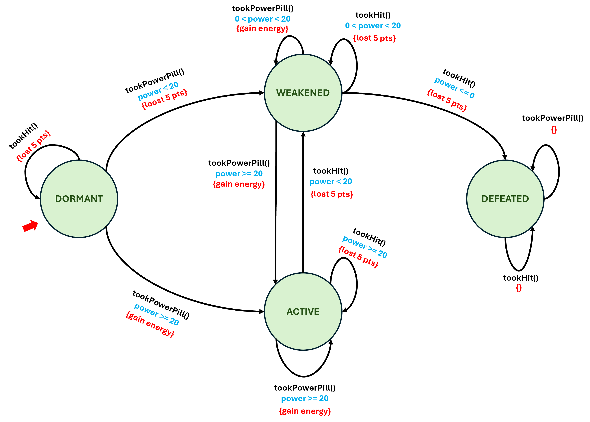

# Skill Builder 5
## Finite State Machines with the Grok


## Learning Outcomes

By the end of this activity, a student should be able to:

1. Write if-else statements to implement conditional logic inside a Java class.
2. Implement a Finite State Machine (FSM) using an enum and if-else or switch statements.
3. Implementing object behavior using an FSM.


## Background: Finite State Machines

A Finite State Machine (FSM) is a model of computation that describes an object as being in exactly one of a fixed number of states at any given time. The object transitions from one state to another in response to events. FSMs are widely used in game design, user interface logic, compilers, and embedded systems.

An FSM is defined by:

- A finite set of states
- A designated initial state
- A set of events (inputs) that can trigger transitions
- Transition rules: for each (state, event) pair, what is the next state?
- Actions performed during or after a transition

### The Grok's FSM

In Skill Builder 4, the Grok had a single integer field, `powerLevel`, but no explicit notion of state. In this assignment, you will add a state to the Grok using a Java enum. The Grok can be in one of four states:

| State | Description |
|---|---|
| `DORMANT` | The Grok starts here. Its power level is at or below 0 (never had a pill, or all power is gone). It has not yet been activated. |
| `ACTIVE` | The Grok has taken at least one power pill and has a power level of 20 or greater. It is a full threat. |
| `WEAKENED` | The Grok has taken hits and its power level has dropped below 20 but is still above 0. It is still dangerous but vulnerable. |
| `DEFEATED` | The Grok's power level has dropped to 0 or below. It can no longer act. |

### State Transition Table

The following table defines the complete FSM. For every combination of current state and event, it specifies the action taken and the resulting next state.

| Current State | Event | Action | Next State | Notes |
|---|---|---|---|---|
| DORMANT | takePowerPill | Gain energy | ACTIVE | Power >= 20 |
| DORMANT | takePowerPill | Stay low | WEAKENED | Power < 20 |
| DORMANT | tookHit | Lose 5 pts | DORMANT | Always |
| ACTIVE | takePowerPill | Gain energy | ACTIVE | Always |
| ACTIVE | tookHit | Lose 5 pts | ACTIVE | Power still >= 20 |
| ACTIVE | tookHit | Lose 5 pts | WEAKENED | Power 1–19 |
| ACTIVE | tookHit | Lose 5 pts | DEFEATED | Power <= 0 |
| WEAKENED | takePowerPill | Gain energy | ACTIVE | Power >= 20 |
| WEAKENED | takePowerPill | Gain energy | WEAKENED | Power still < 20 |
| WEAKENED | tookHit | Lose 5 pts | WEAKENED | Power still > 0 |
| WEAKENED | tookHit | Lose 5 pts | DEFEATED | Power <= 0 |
| DEFEATED | takePowerPill | No effect | DEFEATED | Grok is dead |
| DEFEATED | tookHit | No effect | DEFEATED | Grok is dead |

### State Diagram



## State Description

Inside the `Grok` class (as a nested enum ), a public enum called `GrokState` with the four values is defined:

```java
public enum GrokState {
    DORMANT,
    ACTIVE,
    WEAKENED,
    DEFEATED
}
```

and a state 

## Required Activities

### Part 1: Add a State to the Grok Class

Modify your `Grok` class from Skill Builder 4 as described below.


#### Step 1 — Add a getter for each state

Add the following accessor methods with their javadoc comment:

```java
/*
     * Returns true if this Grok is in a dormant state; false otherwise.
     * @return true if this Grok is in a dormant state; false otherwise.
     */
    public boolean isDormant()
```

```
/*
     * Returns true if this Grok is in a weakened state; false otherwise.
     * @return true if this Grok is in a weakened state; false otherwise.
     */
    public boolean isWeakened()
```

```
/*
     * Returns true if this Grok is in an active state; false otherwise.
     * @return true if this Grok is in an active state; false otherwise.
     */
    public boolean isActive()
```

```
/*
     * Returns true if this Grok is in a defeated state; false otherwise.
     * @return true if this Grok is in a defeated state; false otherwise.
     */
    public boolean isDefeated()
```

#### Step 4 — Modify takePowerPill to update state

Update the `takePowerPill` method so that after adding the pill's power, it updates `state` according to the FSM transition table:

- If the Grok is `DEFEATED`, do nothing (no power gain, no state change) - so, just return.
- Otherwise, add the pill's power to the Grok's power level.
- After updating the power level, use an if-else statement to set the new state

<div style="background-color:#00ddff; padding: 5px; border-radius:5px;">
<strong>Hint:</strong> the <code>DORMANT</code> state only persists if the Grok has never successfully taken a pill (or has been hit down to 0 without ever receiving a pill). Once a pill is taken and power > 0, the Grok is either <code>ACTIVE</code> or <code>WEAKENED</code>.
</div>

#### Step 5 — Modify tookHit to update state

Update the `tookHit` method so that it updates `state` according to the FSM:

- If the Grok is `DEFEATED`, do nothing.  Just return.
- Subtract 5 from the power level.
- Use an if-else statement to set the new state.


### Using the Symbolic Debugger

Set a breakpoint inside `tookHit` or `takePowerPill` and step through several transitions. Verify that `state` changes correctly as `powerLevel` crosses the 20 and 0 thresholds.

### Using AI as a Coach

You may use an AI like Claude to provide hints on how to proceed or get hints as to where potential errors are in code you write.  Always provide context as to who you are and what you do not want the AI to provide.  Use the "persona and constraint" prompt approach.

For example,

*I am a student learning Java.  I do not want you to give me answers. I would like you to serve as a coach and help me with difficulties by providing hints and suggestions.  Before moving to the next hint, ask me what I think the next step should be.  If I’m stuck on a concept like Polymorphism or Interfaces, try to explain it using a real-world analogy but do not show me code.  If I share my code, don't rewrite it for me. Point out the line number where the logic fails and tell me why it's happening. Please stick to standard Java libraries and avoid using external frameworks unless I specifically ask for them.*

Since Java is a verbose and boilerplate heavy language, AIs tend to try and fix things by adding imports of things not covered in the course.  Make sure you add that last sentence above.


## Deliverables

Submit the following files:

- `Grok.java` (updated with the state field and modified methods)

Please submit the **Grok.java** file on CodeGrade when you have completed the work.  The Game Guru will then score your work and add it the dev release if it is worthy.

<span style="font-size:2em;color:green;">Happy Coding!</span>
